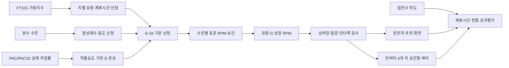

# 덕남정수장 혼화·플록형성 G/RPM 추천·제어 알고리즘 상세설계문서

## 1. 목적과 적용범위

본 문서는 `덕남_응집제공정_소독공정_통합.parquet`과 덕남정수장 기술진단 결과를 이용하여 혼화·플록형성 공정의 교반강도 `G`, `Gt` 및 플록큐레이터 1·2·3단 RPM을 산정하고 운전자에게 추천하는 기능을 설계한다.

적용범위는 다음과 같다.

- 착수정 낙차부 수류혼화의 체류시간·혼화강도 감시
- 수온별 표준 G값과 RPM 산정
- 유량·가동지수에 따른 지별 체류시간과 Gt 검토
- 3단 점감식 플록큐레이터 RPM 추천
- 인버터 설치 4개 지의 운전자 승인형 RPM 제어
- 침전수 탁도와 연계한 추천결과 사후평가
- RPM·플록영상 데이터 축적 후 AI 최적화로 전환하기 위한 인터페이스 정의

다음 기능은 현재 범위에서 제외한다.

- 현재 사용하지 않는 수직터빈형 급속혼화기 12대의 자동 재가동
- 인버터가 없는 나머지 8개 지의 자동 RPM 변경
- 현재 데이터에 없는 플록 입경·밀도를 이용한 폐루프 제어
- 검증되지 않은 PAC·PACS2 합산값을 이용한 G값 제어

## 2. 설계 결론

덕남정수장은 기계식 급속혼화기를 사용하지 않고 착수정 낙차부에서 수류혼화를 수행한다. 따라서 급속혼화 구간은 `G 감시기능`으로 설계하고, 실제 RPM 추천·제어 대상은 인버터가 설치된 수평패들형 플록큐레이터로 한정한다.

현재 parquet에는 플록큐레이터 RPM·인버터 주파수·지별 유량이 없으므로 1단계는 물리식과 기술진단서 표준운영표를 결합한 규칙기반 추천방식으로 구현한다. 추천값과 실제 RPM·침전수 탁도 데이터가 축적된 이후에만 AI 기반 최적 G/RPM 모델을 승인한다.

## 3. 현장 설비와 설계기준

### 3.1 급속혼화 시설

| 항목 | 기술진단서 확인값 | 설계 반영 |
| --- | ---: | --- |
| 혼화지 | 12지, 55.3m³/지, 총 663.66m³ | 체류시간 참고값 |
| 기계식 혼화기 | 수직터빈형, D1.24m, 22kW, 12대 | 현재 미사용, 자동제어 제외 |
| 회전계통 | Flat 6-Blades Turbine, 모터 1,170rpm, 감속비 30:1 | 향후 재가동 검토용 제원 |
| 현재 혼화방식 | 착수정 낙차부 수류혼화 | G 감시 대상 |
| 낙차부 실측 수두손실 | 0.45m | 수류식 G 산정 |
| 평균유량 기준 혼화시간 | 99.1초 | 유량보정 기준 |
| 평균유량 | 227,728m³/d = 9,488.667m³/h | 기준유량 |
| 운전범위 G | 평균~최대유량, 수온조건 기준 169.5~282.3s⁻¹ | 감시 기준 |

### 3.2 플록형성 시설

| 항목 | 기술진단서 확인값 | 설계 반영 |
| --- | ---: | --- |
| 총 지수 | 12지 | 지별 추천값 산출 |
| 구성 | 1계열 6지, 2계열 6지 | 계열별 분리 |
| 유효용량 | 776m³/지, 총 9,314m³ | 체류시간·Gt 산정 |
| 플록형성방식 | 3단 점감식 | `G1 ≥ G2 ≥ G3` 강제 |
| 플록큐레이터 | 수평패들형 | 패들식 RPM-G 관계 사용 |
| 회전방향 | 정-정-정 | 현재 운영조건 유지 |
| 변속운전 | 12지 중 4지 인버터 개선 완료 | 자동제어 가능범위 제한 |
| 일반 RPM 기준 | 1~5rpm | 최종 하드 한계 |
| G 기준 | 1단 50, 2단 30, 3단 10s⁻¹ | 기본 목표값 |
| Gt 기준 | 3×10⁴~2×10⁵ | 하드 품질제약 |
| 표준운영 Gt | 평균유량에서 약 1.1×10⁵ | 기준 중심값 |
| 패들면적비 | 15.1% | 적정범위 10~25% |
| D/T | 0.78 | 기준보다 다소 큼, 과교반 주의 |

### 3.3 기술진단서 수온별 표준 RPM

표 2.3-13의 평균유량 조건을 시스템 기본 룩업테이블로 등록한다.

| 원수 수온 | 1단 RPM | 2단 RPM | 3단 RPM | 목표 G(1/2/3단) | 합계 Gt |
| ---: | ---: | ---: | ---: | --- | ---: |
| 5℃ | 2.05 | 1.46 | 0.70 | 50/30/10s⁻¹ | 1.1×10⁵ |
| 10℃ | 1.95 | 1.39 | 0.67 | 50/30/10s⁻¹ | 1.1×10⁵ |
| 15℃ | 1.86 | 1.32 | 0.64 | 50/30/10s⁻¹ | 1.1×10⁵ |
| 20℃ | 1.79 | 1.27 | 0.61 | 50/30/10s⁻¹ | 1.1×10⁵ |
| 25℃ | 1.72 | 1.22 | 0.59 | 50/30/10s⁻¹ | 1.1×10⁵ |
| 30℃ | 1.66 | 1.18 | 0.57 | 50/30/10s⁻¹ | 1.1×10⁵ |

현재 실측 운전에서는 지별 G값 편차와 3단 G값 기준미달이 확인되었으므로, 시스템은 단순 평균 RPM이 아니라 지별·단별 추천값과 편차경보를 제공한다.

## 4. 데이터 설계

### 4.1 현재 데이터 개요

| 항목 | 확인 결과 |
| --- | --- |
| 행 수 | 950,286행 |
| 기간 | 2024-05-07 04:29 ~ 2026-02-26 02:34 |
| 기본 주기 | 1분 |
| 전체 컬럼 | 41개 |

### 4.2 현재 사용 가능한 컬럼

| 기능 | 컬럼 | 사용방법 |
| --- | --- | --- |
| 총유량 | `RCS_1.AI.FT101` | 체류시간·지별 유량 추정 |
| 원수 수온 | `RCS_6.AI.착수정_온도` | 점성계수·밀도·표준 RPM 산정 |
| 원수 탁도 | `RCS_6.AI.착수정_TB` | 운전상태·플록부하 구분 |
| 원수 pH | `RCS_6.AI.착수정_PH` | 응집조건 유효성 검토 |
| 알칼리도 | `RCS_6.AI.착수정_AL` | 응집조건 보조변수 |
| 전기전도도 | `RCS_6.AI.착수정_전기전도도` | 원수상태 보조변수 |
| PAC 주입률 후보 | `PAC.AI.PAC_주입율제어_SV` | PAC 활성 시 C 후보 |
| PACS2 주입률 후보 | `PAC.AI.PACS2_주입율제어_SV` | PACS2 활성 시 C 후보 |
| 약품 설정 | PAC/PACS2 목표주입량·주입량제어 SV | 운전상태 참고, 단위 확인 후 사용 |
| 실제 주입상태 후보 | 주입유량1·2, 주입량 A1·B1·A2·B2 | 약품-펌프 매핑 후 사용 |
| 침전수 품질 | `RCS_6.AI.침전지1_탁도`, `RCS_6.AI.침전지2_탁도` | 체류시간 정렬 후 사후평가 |
| 침전수 pH | `RCS_6.AI.침전지1_PH`, `RCS_6.AI.침전지2_PH` | 보조 품질제약 |

### 4.3 데이터 품질 현황과 적용규칙

| 컬럼 | 결측률 | 중앙값 | 1~99% 범위 | 적용규칙 |
| --- | ---: | ---: | ---: | --- |
| `FT101` | 0.11% | 7,498 | 5,973~9,279 | 값의 크기로는 m³/h가 유력하나 SCADA 단위 확정 필요 |
| 착수정 수온 | 11.29% | 15.16℃ | 6.48~20.65℃ | 0℃ 값은 센서·결측코드 여부 확인 후 제외 |
| 착수정 탁도 | 11.29% | 1.56NTU | 0.89~3.64NTU | 0과 상한 50은 품질플래그 확인 |
| PAC/PACS2 주입률제어 SV | 5.55% | 각각 16 | PAC 14~17, PACS2 14~17 | 두 값 동시 존재 시 합산 금지 |
| 침전지1 탁도 | 11.29% | 0.188NTU | 0.062~0.551NTU | 체류시간 정렬 후 평가 |
| 침전지2 탁도 | 11.29% | 0.197NTU | 0.073~0.479NTU | 체류시간 정렬 후 평가 |

다음 조건에서는 RPM 추천을 중지한다.

- 수온 또는 유량이 5분 이상 연속 결측
- 유량이 0이거나 계측기 품질상태가 불량
- 수온이 유효범위 0~35℃를 벗어남
- 가동지수 또는 제어대상 지가 확인되지 않음
- 실제 사용 약품이 PAC인지 PACS2인지 식별되지 않은 상태에서 약품농도 기반 보정을 요청함

### 4.4 추가 수집 필수 태그

| 우선순위 | 태그 | 목적 |
| ---: | --- | --- |
| 1 | 지별 운전/휴지 상태 | 지별 유량·체류시간 산정 |
| 1 | 1·2·3단 RPM 실측값 | 추천값 검증·폐루프 제어 |
| 1 | 1·2·3단 인버터 Hz와 SV | 제어명령·추종성 검증 |
| 1 | 로컬/원격, 자동/수동, VFD Ready | 안전 인터록 |
| 1 | 모터 전류·전력·과부하 | 동력·이상상태 감시 |
| 2 | 지별 또는 계열별 유량 | 체류시간 정확도 향상 |
| 2 | 실제 사용 응집제와 전환시각 | PAC/PACS2 분리 |
| 2 | PAC/PACS2 실제 주입률(mg/L) | 약품농도 기반 G 후보 산정 |
| 3 | 플록 입경·밀도·영상지표 | AI 최적화 목표값 |

## 5. 전체 기능 구조



기능은 다음 모듈로 분리한다.

1. 데이터 유효성 검사기
2. 지별 유량·체류시간 산정기
3. 수온별 물성 산정기
4. 낙차부 G 감시기
5. 플록형성지 G·Gt 목표 산정기
6. 수온별 RPM 룩업·보간기
7. RPM 제약조건·안전검사기
8. 추천·제어 명령 관리자
9. 침전수 결과 정렬·성과평가기
10. 이력·버전·사유코드 기록기

## 6. 유량과 체류시간 산정

### 6.1 총유량 단위 정규화

`FT101`은 값의 범위상 m³/h로 판단되지만 운영 적용 전 SCADA 정의서로 확정한다.

```text
Q_total_m3h = FT101                     # FT101 단위가 m³/h인 경우
Q_total_m3h = FT101 / 24                # FT101 단위가 m³/d인 경우
```

단위가 확정되지 않으면 시스템은 추천값만 표시하고 제어명령을 생성하지 않는다.

### 6.2 지별 유량 배분

유량 입력 우선순위는 다음과 같다.

1. 지별 실시간 유량
2. 계열별 유량과 계열 내 지별 분배율
3. 총유량과 기술진단서 실측 유량비
4. 총유량을 가동지수로 균등배분

```text
Q_basin,j = Q_total × w_j
Σw_j = 1
```

2024-08-27 측정한 8개 가동지의 초기 유량비는 10.3%, 12.8%, 12.0%, 14.4%, 11.5%, 11.3%, 15.8%, 11.8%이다. 당시와 가동구성이 같을 때만 초기값으로 사용하고 가동지가 변경되면 균등분배 또는 신규 측정값을 사용한다.

### 6.3 플록형성지 체류시간

```text
T_floc,j(min) = 60 × 776 / Q_basin,j(m³/h)

T_stage,j(sec) = 60 × T_floc,j / 3
```

3개 단의 유효용량이 동일하다는 초기 가정으로 3등분한다. 시공도면에서 단별 용량이 다르면 `V_stage,k`를 별도로 등록하여 다음 식으로 교체한다.

```text
T_stage,j,k(sec) = 3600 × V_stage,j,k / Q_basin,j
```

### 6.4 원수조건의 플록형성지 도달시각

기술진단서의 착수정 낙차부 혼화 이후 플록형성지까지 평균유량 기준 11.3분을 유량에 따라 보정한다.

```text
T_upstream(t) = 11.3 × 9,488.667 / Q_total(t)       min

원수수질_for_floc(t) = 원수수질[t - T_upstream(t)]
```

실시간 RPM 추천에는 현재 착수정 수질이 아니라 현재 플록형성지에 도달한 물의 추정 원수수질을 사용한다. 수온은 변화가 느리지만 탁도·pH·응집제 주입률은 반드시 시간정렬한다.

## 7. 수온별 점성계수와 밀도

수온 `T`의 단위는 ℃로 한다. 동점성이 아니라 동적점성계수 `μ`를 사용한다.

```text
μ(T) = 2.414×10⁻⁵ × 10^[247.8/(T+133.15)]        Pa·s

ρ(T) = 1000 × {1 - [(T+288.9414)/(508929.2×(T+68.12963))]
                   × (T-3.9863)²}                 kg/m³
```

- 5~30℃는 기술진단서 표준 RPM 구간으로 선형보간한다.
- 5℃ 미만은 5℃ 값을, 30℃ 초과는 30℃ 값을 사용하되 범위외 경보를 발생시킨다.
- 0~35℃를 벗어나면 추천을 중지한다.
- 물성식 버전과 적용 수온을 모든 추천이력에 저장한다.

## 8. 착수정 낙차부 G 감시

### 8.1 낙차부 체류시간

평균유량에서 확인된 99.1초를 유량에 반비례하여 보정한다.

```text
T_drop(t) = 99.1 × 9,488.667 / Q_total(t)          sec
```

### 8.2 수류식 G값

```text
G_drop(t) = √[ρ(T) × g × h_loss / {μ(T) × T_drop(t)}]

g      = 9.80665m/s²
h_loss = 0.45m
```

20℃, 평균유량 조건에서 약 210s⁻¹이 산정되어 기술진단서의 209.9s⁻¹과 일치해야 한다. 이 계산은 급속혼화 상태를 감시하기 위한 것이며 기계식 혼화기 RPM 명령으로 변환하지 않는다.

### 8.3 약품농도 기반 경험식

요구 이미지의 Letterman 경험식은 보조지표로 계산한다.

```text
G_letterman = [4.4×10⁶ / {C_active × T_mix}]^(1/2.8)

C_active = 실제 사용 응집제의 실투입농도(mg/L)
T_mix    = 적용 혼화시간(sec)
```

PAC와 PACS2의 설정값이 동시에 존재해도 합산하지 않는다. 실제 사용약품과 실투입농도가 확인되지 않으면 `G_letterman`은 산출하지 않는다. 경험식은 덕남 현장 검증 전에는 제어권한을 갖지 않고, `G_drop`·표준 G·침전수 결과와 비교하는 참고지표로만 사용한다.

## 9. 플록형성지 목표 G와 Gt

### 9.1 기본 목표

```text
G_base = [50, 30, 10] s⁻¹
```

점감조건을 다음과 같이 강제한다.

```text
G1 ≥ G2 ≥ G3
```

### 9.2 Gt 산정

```text
Gt_total,j = Σ(k=1..3) [G_target,j,k × T_stage,j,k]
```

- 승인범위: `3×10⁴ ≤ Gt_total ≤ 2×10⁵`
- 평균유량 기준 중심값: 약 `1.1×10⁵`
- 승인범위에 있으면 유량만을 이유로 G값을 변경하지 않는다.
- 승인범위를 벗어나면 자동 보정보다 가동지수·유량단위·시설용량 오류를 먼저 점검한다.

### 9.3 운전조건별 후보 G

현재 RPM 이력이 없으므로 AI가 최적 G를 직접 학습하지 않는다. 다음 후보군을 그림자 운전에서 비교한다.

| 후보 | 1단 | 2단 | 3단 | 용도 |
| --- | ---: | ---: | ---: | --- |
| 표준 | 50 | 30 | 10 | 기본 추천 |
| 완화 | 45 | 27 | 9 | 저탁도·플록파괴 우려 시 검토 |
| 강화 | 50 | 35 | 12 | 고탁도·저수온 시 검토 |

모든 후보는 `G1 ≥ G2 ≥ G3`, 전체 Gt 범위, RPM 상·하한을 만족해야 한다. 현재 단계의 운영 추천은 표준후보를 기본으로 하고 완화·강화 후보는 침전수 탁도 사후평가용으로만 저장한다.

## 10. 수온별 RPM 추천

### 10.1 기본 RPM 보간

수온별 표준 RPM 표에서 인접 두 온도를 선형보간한다.

```text
RPM_std,k(T)
  = RPM_k(T_low)
  + {RPM_k(T_high)-RPM_k(T_low)}
    × (T-T_low)/(T_high-T_low)
```

예를 들어 원수 수온이 17℃이면 15℃와 20℃의 1·2·3단 RPM 사이를 각각 보간한다.

### 10.2 목표 G 보정 RPM

수평패들형 교반기에서 동일 설비·수온 조건이면 `G² ∝ RPM³` 관계를 적용할 수 있다.

```text
RPM_rec,j,k
  = RPM_std,k(T)
    × [G_target,j,k / G_base,k]^(2/3)
```

이 식은 기술진단서의 수평패들형 표준 RPM을 기준점으로 사용한다. 요구 이미지의 수직터빈형/하이드로포일형 RPM 식은 현재 제어대상인 수평패들형 플록큐레이터에 직접 적용하지 않는다.

### 10.3 패들식 물리식 검산

패들 제원이 확정되면 다음 식으로 추천 RPM을 독립 검산한다.

```text
P = C_D × A × ρ × v_rel³ / 2
G = √[P/(μ×V)]
v_rel ≈ 0.75 × π × D × RPM / 60

RPM_physical
  = 60/(0.75×π×D)
    × [2×μ×V×G²/(C_D×A×ρ)]^(1/3)
```

`C_D`, 유효 패들면적 `A`, 단별 체적 `V`, 유효회전직경 `D`는 설비도면과 제작사 자료로 확정한다. 값이 확정되기 전에는 표준 RPM 보간값을 제어기준으로 사용한다.

### 10.4 최종 제약조건

```text
RPM_min,k ≤ RPM_rec,k ≤ RPM_max,k
RPM_1 ≥ RPM_2 ≥ RPM_3
Gt_total ∈ [3×10⁴, 2×10⁵]
```

`RPM_min,k`와 `RPM_max,k`는 단별 인버터·감속기 제작사 허용범위로 확정한다. 제작사 값이 확정되기 전의 계산범위는 1·2단 1~5rpm, 3단 0.5~5rpm으로 한다. 기술진단서의 3단 표준 RPM은 0.57~0.70rpm이므로 일반 1rpm 기준은 경보용으로만 적용하고, 임의로 3단을 1rpm 이상으로 올리지 않는다. 제작사 허용최저속도가 표준 RPM보다 높으면 제어를 중지하고 설비검토 대상으로 분류한다.

## 11. 추천·제어 알고리즘

### 11.1 1분 연산주기

1. 최신 유량·수온·원수수질·약품신호와 필요한 과거 시계열을 읽는다.
2. 품질플래그와 결측·범위·급변 여부를 확인한다.
3. 낙차부에서 플록형성지까지의 상류 지연시간을 산정하고, 현재 플록형성지에 도달하는 원수수질을 `t-T_upstream`에서 조회한다.
4. 가동지와 유량분배율을 결정한다.
5. 지별·단별 체류시간을 산정한다.
6. 수온별 점성계수·밀도를 산정한다.
7. 낙차부 `G_drop`을 계산한다.
8. 기본 G `[50,30,10]`과 Gt를 계산한다.
9. 수온별 표준 RPM을 보간한다.
10. 후보 G별 RPM을 산정한다.
11. 상·하한·점감·Gt·VFD·운전모드 인터록을 검사한다.
12. 추천값, 적용가능 여부와 사유코드를 출력한다.
13. 적용된 추천값을 RPM 변경시점 기준 체류시간 후 침전수 탁도와 연결하여 평가한다.

### 11.2 권장 제어주기

- 계산주기: 1분
- 화면 추천값 갱신: 5분 이동중앙값 기준 5분마다
- RPM 변경 최소 유지시간: 초기 30분
- 1회 최대 변경폭: 초기 ±0.05rpm
- 동일방향 연속변경: 운전자 재승인 필요

위 값은 시운전 초기 안전값이다. 인버터 제작사 권고, 실제 추종성, 플록 상태를 확인한 뒤 변경이력과 함께 설정값으로 관리한다.

### 11.3 의사코드

```text
if not data_valid:
    return HOLD(last_safe_rpm, reason_code)

q_total = normalize_flow(FT101)
q_basin = allocate_flow(q_total, active_basins, measured_weights)
t_upstream = upstream_delay(q_total)
raw_at_floc = raw_quality_history[t - t_upstream]
mu, rho = water_properties(raw_at_floc.temperature)
g_drop = hydraulic_G(q_total, current_raw_temperature, h_loss=0.45)

for each active basin j:
    t_stage = residence_time(q_basin[j], volume=776) / 3
    g_target = [50, 30, 10]
    gt = sum(g_target[k] * t_stage[k])
    rpm_std = interpolate_standard_rpm(raw_at_floc.temperature)
    rpm_rec = rpm_std * (g_target / [50,30,10])^(2/3)
    rpm_safe = apply_constraints(rpm_rec, gt, vfd_limits, taper_rule)

    if basin_has_vfd and remote_ready and operator_approved:
        issue_rate_limited_command(rpm_safe)
    else:
        display_recommendation_only(rpm_safe)
```

## 12. 침전수 탁도 연계와 성과평가

RPM 추천시점 `t`의 플록형성지 운전조건은 플록형성지부터 침전지 출수부까지의 지연시간 이후 탁도와 연결한다. 응집제 주입시점부터 출수부까지의 지연시간과 RPM 변경시점부터 출수부까지의 지연시간을 구분한다.

```text
원수·응집제 주입시점 → 출수부
  = 121.3, 333.66, 358.8, 481.2분

플록큐레이터 RPM 변경시점 → 출수부
  첨두응답       = 30 + 80 = 110분
  추적자 평균    = 40.9×1.06 + 5.11×60×0.91 = 322.36분
  추적자 이론    = 40.9 + 5.11×60 = 347.5분
  평균유량 설계표 = 58.9 + 6.85×60 = 469.9분

시간창 후보 = 각 중심의 ±30, ±45, ±60분
탐색범위    = 80~530분
```

```text
원수조건_for_RPM(t) = 원수수질[t - T_upstream(t)]

TB_result,j(t)
  = median{TB_outlet,j[t + T_RPM_to_outlet,j - Δ
                         : t + T_RPM_to_outlet,j + Δ]}
```

즉, RPM 변경효과 평가에는 상류 11.3분을 더하지 않는다. 다만 RPM 결정에 사용되는 원수수질은 해당 물이 플록형성지에 도달하는 상류 지연시간만큼 과거 값과 연결한다.

평가 시 다음 변수를 함께 저장한다.

- 추천 전·후 RPM과 실제 RPM
- 지별·단별 목표 G와 추정 G
- 총 Gt
- 원수 수온·탁도·pH·알칼리도
- 유량과 가동지수
- 실제 응집제와 주입률
- 침전수1·2 탁도와 pH
- 제약조건 발동 여부
- 운전자 수락·거절 및 거절사유

## 13. 피처 관계분석과 모델풀

### 13.1 관계분석

수온·유량·응집제 주입률·체류시간·G·Gt·RPM과 침전수 탁도의 관계를 다음 변환별로 비교한다.

- 원 단위 상관
- `log1p(x)` 변환 상관
- `sqrt(x)` 변환 상관
- `x²` 변환 상관
- `1/(x+ε)` 역수 변환 상관
- 수온×유량, G×체류시간, RPM³/점성계수 상호작용
- Pearson, Spearman, 상호정보량
- 체류시간 후보별 시차상관과 DTW

변환은 학습구간에서만 적합하고 검증·시험구간에 동일하게 적용한다. 상관관계만으로 RPM의 인과효과를 확정하지 않는다.

### 13.2 모델풀 적용조건

현재 데이터에는 실제 RPM 변동이 없으므로 모델풀은 침전수 탁도 기준모델의 성능 비교에만 사용한다.

| 모델 | 현재 단계 | RPM 데이터 축적 후 |
| --- | --- | --- |
| 다변수 회귀 | 기준선·설명성 | G/RPM 민감도 검토 |
| Random Forest | 비선형 기준모델 | 운전구간별 반응 검토 |
| XGBoost | 주력 표형데이터 모델 | 후보 RPM별 탁도 예측 |
| LSTM | 장기 시계열 기준모델 | 장기 플록·탁도 반응 |
| GRU | 시계열 비교모델 | 계절·주기성 반응 |

모든 모델은 동일 시계열 분할과 동일 피처·목표를 사용하여 성능만 비교한다. 현재 단계에서 모델출력으로 RPM을 자동 변경하지 않는다.

### 13.3 평가항목

```text
RMSE = √mean((y-ŷ)²)
MAE  = mean(|y-ŷ|)
sMAPE = mean[2|y-ŷ|/(|y|+|ŷ|+ε)]×100
R2(R²) = 1-Σ(y-ŷ)²/Σ(y-ȳ)²
```

- 침전수 탁도 예측목표: 독립 시험구간 sMAPE 5% 이하
- 보조평가: RMSE, MAE 최소, R2(R²) 최대
- 저탁도 안정화값 `ε`: 초기 0.01NTU, 계측기 최소분해능 확인 후 고정
- sMAPE 5%를 충족하지 못하면 AI 모델은 참고용이며 규칙기반 RPM 추천을 대체하지 않는다.

## 14. 안전·제어 인터록

### 14.1 제어 허용조건

다음 조건을 모두 만족해야 인버터 설치 지에 제어명령을 생성한다.

- 해당 지 운전상태
- 해당 단 플록큐레이터 운전 중
- VFD Ready 및 원격모드
- AI 추천 허용스위치 ON
- 운전자 승인 완료
- 수온·유량·수위·RPM 피드백 정상
- 모터 과부하·고장·통신장애 없음
- 추천 RPM이 설비·점감·Gt 제약조건 만족

### 14.2 즉시 HOLD 조건

- RPM 피드백이 명령값을 허용오차 밖에서 추종하지 못함
- 모터 전류 또는 토크가 설비 상한 초과
- 수위 급변, 지 운휴 전환, 유량 급변
- 센서 결측 또는 시간동기 불량
- 1·2·3단 점감관계 위반
- 운전자 수동모드 전환

HOLD 시 마지막 안전 RPM 또는 현장 기본 RPM을 유지하며 원격에서 임의 정지명령을 발생시키지 않는다.

### 14.3 권한단계

| 단계 | 기능 | 제어권한 |
| --- | --- | --- |
| 0 | 계산 검증 | 없음 |
| 1 | 그림자 추천 | 화면 미표출 또는 시험화면 |
| 2 | 운전자 참고 | 추천값·근거 표시 |
| 3 | 운전자 승인형 | 승인 후 4개 인버터 지에 제한 적용 |
| 4 | 제한 자동화 검토 | 충분한 실적과 안전성 검증 후 별도 승인 |

## 15. 출력·화면·이력 설계

### 15.1 주요 출력

| 출력 | 단위 | 설명 |
| --- | --- | --- |
| `G_drop` | s⁻¹ | 낙차부 수류혼화 G |
| `T_floc_basin` | min | 지별 플록형성 체류시간 |
| `G_target_1/2/3` | s⁻¹ | 단별 목표 G |
| `Gt_total` | - | 전체 플록형성 Gt |
| `RPM_std_1/2/3` | rpm | 수온별 표준 RPM |
| `RPM_rec_1/2/3` | rpm | 제약조건 적용 추천 RPM |
| `control_available` | boolean | 제어가능 여부 |
| `reason_code` | code | 추천·HOLD·제약 사유 |
| `expected_TB1/TB2` | NTU | 선택 모델의 예상 침전수 탁도 |

### 15.2 운전자 화면

화면에는 다음을 동시에 표시한다.

- 현재 수온·유량·가동지수
- 낙차부 G와 정상범위
- 지별 1·2·3단 현재 RPM, 표준 RPM, 추천 RPM
- 목표 G 50/30/10과 계산 Gt
- 적용가능 여부와 제한조건
- 변경 전후 예상 침전수 탁도
- 추천 사유, 모델·물성식·룩업테이블 버전
- 승인·거절·HOLD 버튼과 이력

### 15.3 사유코드

| 코드 | 의미 |
| --- | --- |
| `OK_STANDARD` | 표준 RPM 추천 |
| `OK_TEMP_INTERP` | 수온보간 적용 |
| `WARN_TEMP_CLAMP` | 5~30℃ 범위외 표준값 고정 |
| `WARN_FLOW_EST` | 지별 유량 추정값 사용 |
| `WARN_NO_ACTIVE_CHEM` | 실제 약품 미확정, Letterman G 미산정 |
| `HOLD_DATA_MISSING` | 필수 데이터 결측 |
| `HOLD_VFD_NOT_READY` | 인버터 제어 불가 |
| `HOLD_TAPER_VIOLATION` | 점감조건 위반 |
| `HOLD_LIMIT` | RPM·Gt·모터 한계 위반 |
| `DISPLAY_ONLY_NO_VFD` | 인버터 미설치 지, 화면표출만 가능 |

## 16. 검증계획

### 16.1 수식 단위시험

- 20℃·평균유량에서 낙차부 G가 약 209.9s⁻¹인지 확인
- 표준 수온 5·10·15·20·25·30℃에서 표 2.3-13 RPM이 정확히 재현되는지 확인
- 중간 수온에서 선형보간 결과가 두 기준값 사이인지 확인
- 표준 G에서 RPM 보정계수가 1인지 확인
- G 증가 시 RPM이 단조증가하는지 확인
- `G1 ≥ G2 ≥ G3`와 RPM 한계를 위반하는 결과가 차단되는지 확인

### 16.2 과거데이터 재현

- 1분 시계열의 유량·수온으로 추천 RPM 전기간 산출
- 결측·0값·범위외 상태에서 추천중지 여부 확인
- 계절별 추천 RPM 분포와 표준표 일치성 확인
- 체류시간 정렬 후 침전수 탁도 결과 연결
- 고탁도·저수온·고유량 구간을 별도 시험집합으로 평가

### 16.3 그림자 운전

- 최소 3개월, 여름·겨울 또는 수온변화 구간 포함
- 실제 운전자 RPM과 추천 RPM 차이 기록
- 추천 수락률·거절사유 분석
- 침전수 탁도 악화 과소예측률 평가
- 지별 RPM 추종오차·모터전류·통신장애 평가

### 16.4 승인기준

| 구분 | 승인기준 |
| --- | --- |
| 수식 재현 | 표준표와 반올림 오차 이내 일치 |
| 추천 가용률 | 유효데이터 구간 95% 이상 |
| 제약 위반 | 0건 |
| 점감 위반 | 0건 |
| 제어 추종 | 제작사·현장 승인 오차범위 이내 |
| 침전수 탁도 모델 | 독립시험 sMAPE 5% 이하, RMSE·MAE·R2(R²) 병행 |
| 운전안전 | 수질악화·설비과부하 증가 없음 |

## 17. 단계별 구축계획

### 17.1 1단계 - 규칙기반 계산기

- FT101·수온 데이터 연결
- 낙차부 G 계산
- 수온별 표준 RPM 보간
- 지별 체류시간·Gt 계산
- 추천값과 사유코드 저장

### 17.2 2단계 - 그림자 화면

- 현재 RPM 태그 연결
- 현재값·표준값·추천값 비교
- 운전자 승인 없이 추천성능만 평가
- 침전수 탁도 체류시간 정렬

### 17.3 3단계 - 운전자 승인형 제어

- 인버터 설치 4개 지부터 적용
- RPM 변화율·최소 유지시간 제한
- 승인·거절·HOLD 이력화
- 나머지 8개 지는 화면 추천만 제공

### 17.4 4단계 - AI 최적화 검토

- RPM·VFD·지별 유량·플록영상 데이터 축적
- 동일 데이터분할에서 모델풀 성능 비교
- 후보 RPM별 침전수 탁도·플록품질 예측
- sMAPE 5%와 안전기준을 충족한 경우에만 규칙기반 추천의 보정모델로 제한 적용

## 18. 완료기준과 산출물

### 18.1 완료기준

- 기술진단서의 낙차부 G와 수온별 RPM 표 재현
- 현재 parquet 컬럼과 계산모듈 매핑 완료
- 가동지·인버터 상태에 따른 추천/제어 권한 분리
- PAC·PACS2 비합산 규칙 구현
- 지별 체류시간·Gt·RPM·사유코드 이력 저장
- 모든 상·하한·점감·HOLD 시험 통과
- 침전수 탁도 평가에서 RMSE·MAE·sMAPE·R2(R²) 출력
- 모델 sMAPE 5% 미달 시 자동 승격 차단

### 18.2 산출물

- 수온별 물성·RPM 룩업테이블
- 낙차부 G 계산모듈
- 지별 체류시간·Gt 계산모듈
- 3단 RPM 추천·제약조건 모듈
- 인버터 승인형 제어 인터페이스
- 추천·승인·거절·HOLD 이력 테이블
- 침전수 탁도 사후평가 리포트
- 추가 태그·설비제원 확인서

## 19. 최종 권고

현재 데이터로 즉시 구현할 기능은 `낙차부 G 감시 + 수온별 표준 RPM 추천 + 유량기반 체류시간·Gt 검토`이다. 이를 AI 최적화로 표현하기보다는 물리식·기술진단 기준에 근거한 규칙기반 추천기로 운영한다.

인버터 설치 4개 지에서는 충분한 그림자 운전과 인터록 검증 후 운전자 승인형으로 제한 적용한다. 나머지 8개 지는 인버터 개선 전까지 추천값을 화면에만 표시한다. 실제 RPM·지별 유량·모터전력·플록영상이 축적되면 침전수 탁도와 플록품질을 목표로 하는 AI 보정모델을 추가한다.
