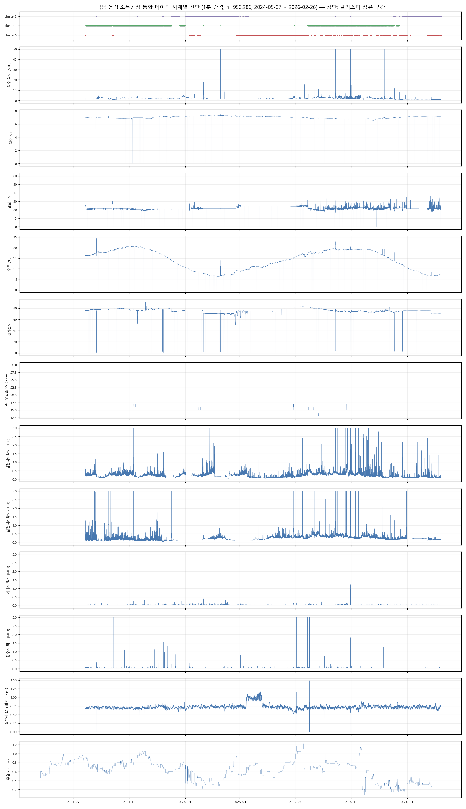
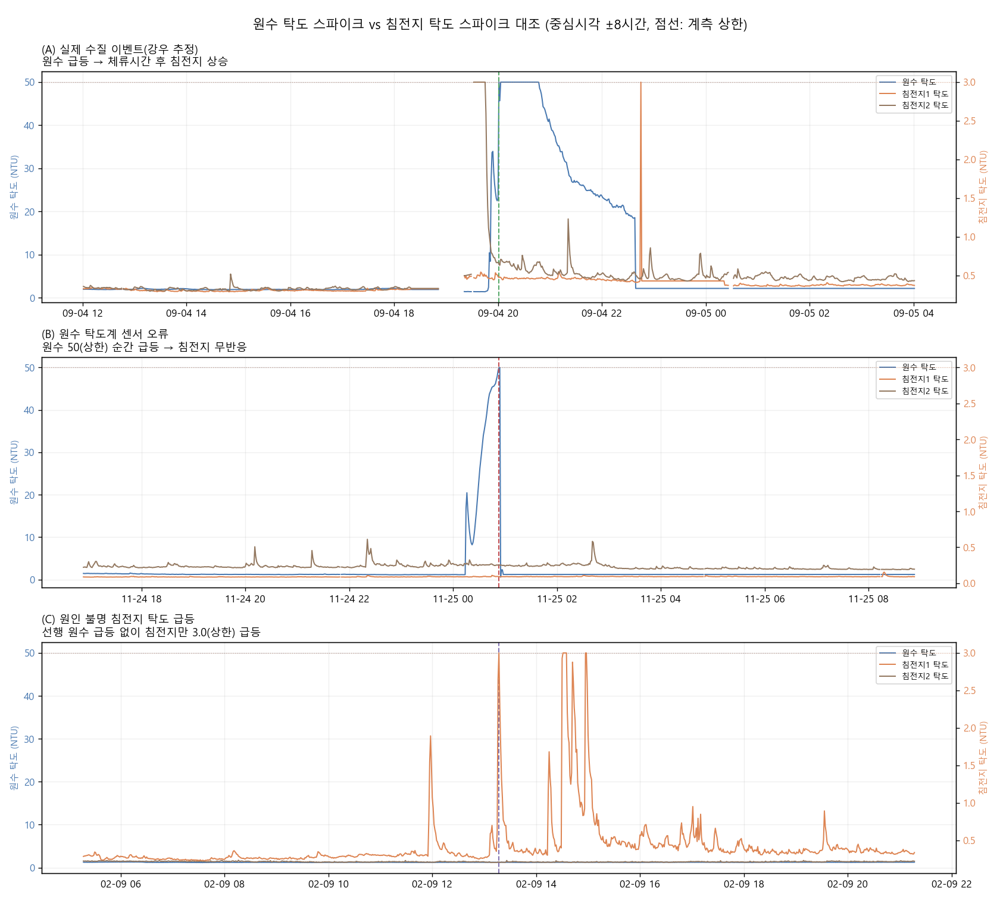
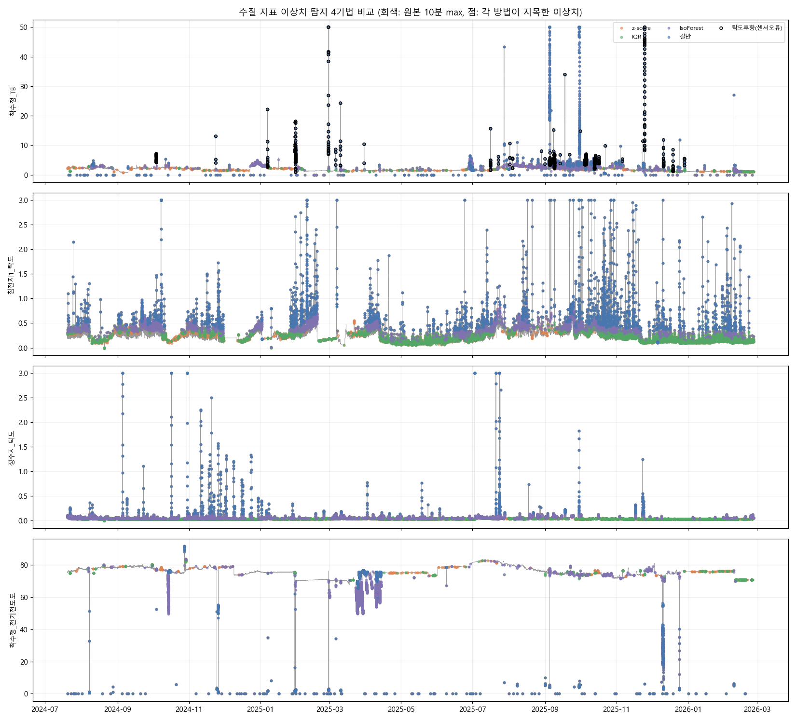
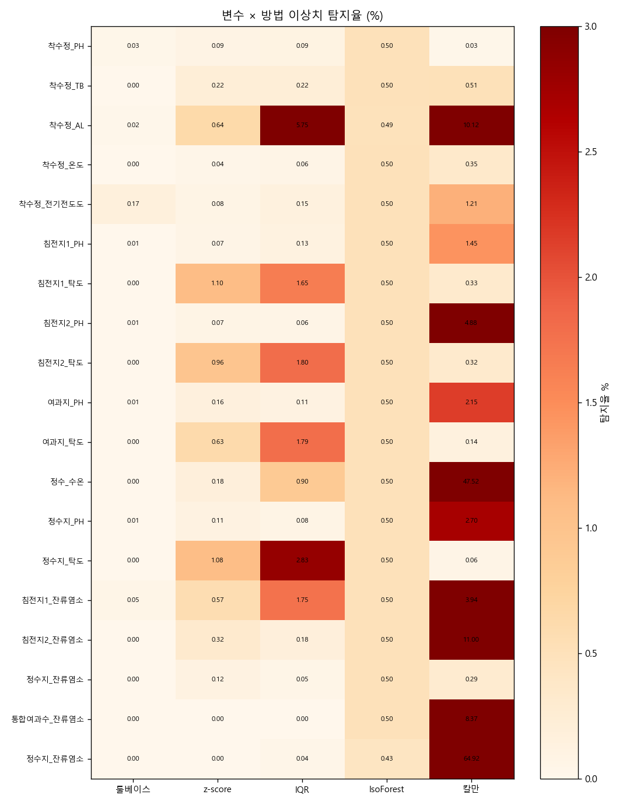
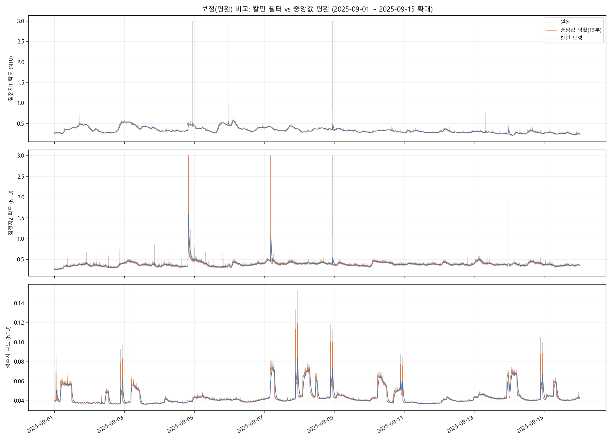
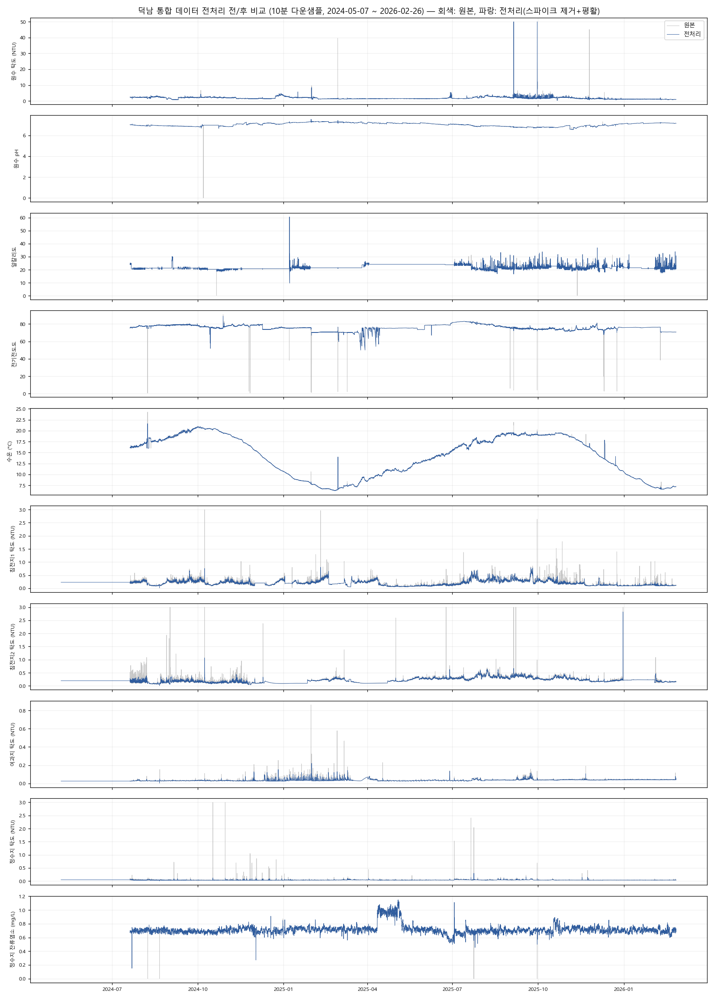
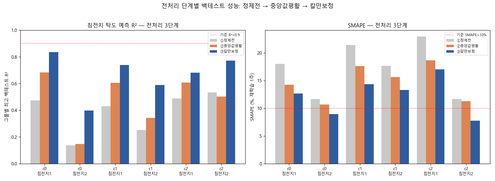
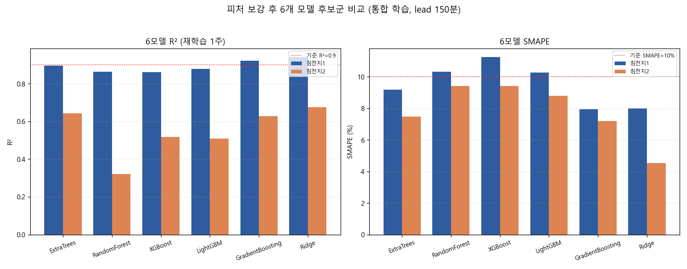
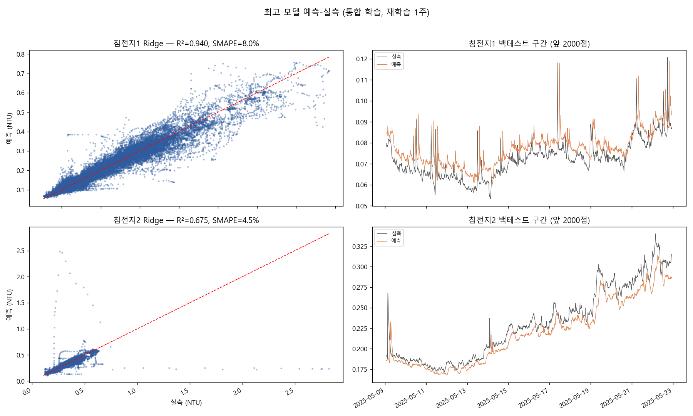
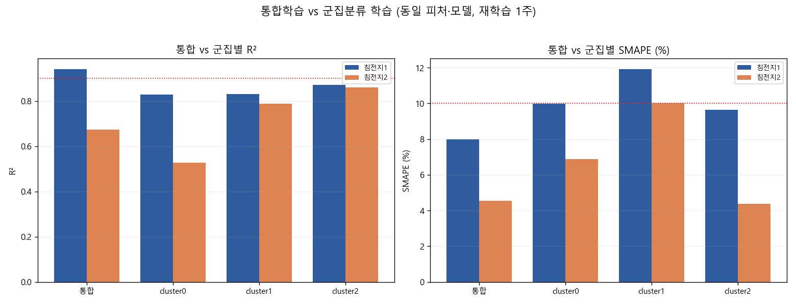

# 덕남정수장 응집공정 침전지 탁도 예측 모델링 리포트

> 덕남·용연 정수장 AI 기반 자율운영 시스템 구축 — 응집제 주입률 모델 선행 연구
> 작성일: 2026-07-22

---

## 1. 개요

### 1.1 목적

응집제(PAC) 주입률 최적화 모델의 선행 단계로, **현재 원수성상과 주입률로부터 체류시간 이후의 침전지 탁도를 예측하는 모델**을 개발한다. 이 예측 모델이 확보되면 "목표 침전 탁도를 만족하는 최소 주입률"을 역산하는 최적화 구조로 확장할 수 있다.

- 목표 기준: **R² ≥ 0.9 / SMAPE ≤ 10%** (오차율 지표는 SMAPE 채택)
- 대상: 침전지 1·2 각각 (수조별 모델)

### 이 보고서의 주요 용어

| 용어 | 쉬운 설명 |
|---|---|
| R² (결정계수) | 실제 값의 오르내림을 모델이 얼마나 잘 따라가는지. 1에 가까울수록 좋고, 0이면 "평균값만 말하는 것"과 같은 수준 |
| SMAPE (오차율) | 예측이 실제와 평균 몇 % 어긋나는지. 낮을수록 좋음 (예: 8% = 실제 0.30 NTU일 때 대략 ±0.02~0.03 수준의 오차) |
| 피처(feature) | 모델에 넣어주는 입력 정보 (원수 탁도, pH, 주입률 등) |
| 이상치 / 스파이크 | 계측기 오류 등으로 순간적으로 튀는 비정상 값 |
| 백테스트 | 과거 데이터로 "그 시점에 실제 운영했다면 얼마나 맞혔을까"를 재현해 보는 검증 방식 (§8에서 상세 설명) |
| 체류시간(lead) | 물이 착수정에서 침전지까지 흘러가는 데 걸리는 시간. 지금 원수가 150분 뒤의 침전지 탁도를 결정 |

### 1.2 데이터 요약

| 항목 | 내용 |
|---|---|
| 원천 | 덕남 응집제공정·소독공정 통합 데이터 (`덕남_응집제공정_소독공정_통합.parquet`) |
| 규모 | 1분 간격 950,286행, 40컬럼 (2024-05-07 ~ 2026-02-26, 결측 거의 없음) |
| 군집 데이터 | 사전 군집분류본 3개 (cluster0: 20,212 / cluster1: 41,395 / cluster2: 22,728행, 10분 간격) |
| 모델링 데이터 | 10분 간격으로 집계 후 95,030행 (모든 피처가 유효한 행 84,257개) |

군집을 시간축에 놓아 보면 **계절별 구간**이었다: cluster0 ≈ 봄~초여름, cluster1 ≈ 여름~가을(2024·2025 두 번), cluster2 ≈ 겨울. 군집 파일에는 원천 데이터에는 없는 빈 기간(어느 군집에도 속하지 않은 구간)이 존재한다.

*그림 1. 통합 데이터 전 구간 시계열. 최상단: 클러스터 점유 구간(계절 블록 구조).*

---

## 2. 데이터 진단 — 발견된 품질 문제

모델링에 앞서 시계열 진단으로 다음 문제를 확인하였다.

| 문제 | 내용 | 규모 |
|---|---|---|
| 계측값 순간 추락 | 전기전도도가 0 부근까지 떨어졌다 복귀, 원수 pH 0.004 기록, 알칼리도 0 기록 — 물리적으로 불가능한 값(계측기 순간 오류) | 전도도 1,572행 등 |
| 계측 상한 걸림 | 계측기가 잴 수 있는 최댓값에 걸려 그 이상은 기록되지 않음 (원수 탁도 50 NTU, 침전지·정수지 탁도 3.0 NTU에서 값이 잘림) | 변수별 51~228행 |
| 계측값 멈춤(고착) | 알칼리도가 최장 307시간(약 13일) 동안 완전히 같은 값으로 정지 — 2025-07 이전엔 사실상 변하지 않는 값이라 계측기 교체가 있었던 것으로 의심 | — |
| 원수 탁도 가짜 급등 | 원수 탁도 급등 49건 중 **약 40%는 이후 침전지 탁도에 아무 변화가 없음** → 실제 수질 변화가 아닌 계측기 오류로 판정 | 14~38건 |
| 원인 불명 침전지 탁도 급등 | 침전지1 탁도 급등 132건 중 **92%가 선행 원수 급등 없이 발생**(계측 노이즈 또는 슬러지 배출 등 내부 공정 요인 추정) → 예측 타깃 오염 | 121건 |
| 침전지2 미사용(운휴) 추정 구간 | 2025-01~04 침전지2 탁도가 0.05 NTU 수준으로 평탄 지속 — **침전지2 미가동 구간으로 추정**. 미가동 시 계측값이 응집·침전 공정 상태를 반영하지 않아 학습에 혼입 시 타깃 왜곡 | 약 3개월 |

가짜 급등과 진짜 급등을 가르는 핵심 근거는 **"원수가 튀면 몇 시간 뒤 침전지도 따라 오르는가"** 였다. 실제 강우로 원수가 탁해지면 물이 흘러가는 시간(2~5시간) 뒤 침전지 탁도도 올라가지만, 계측기 오류는 한쪽만 튀고 다른 쪽은 조용하다.

*그림 2. (A) 실제 수질 이벤트(강우): 원수 급등 → 체류 후 침전지 상승 / (B) 원수 탁도계 오류: 원수만 급등, 침전지 무반응 / (C) 원인 불명 침전지 탁도 급등: 선행 원수 급등 없이 침전지만 급등.*

---

## 3. 전처리 방법

### 3.1 이상치 탐지 기법 비교 (탐지 단계)

수질 지표 19개(원수·침전지1·2·여과지·정수지의 pH/탁도/온도/전도도/알칼리도/잔류염소, 공정 제어 컬럼 제외)에 대해 여러 이상치 탐지 기법을 비교하였다.

| 기법 | 원리 (쉬운 설명) | 비교 결과 | 판정 |
|---|---|---|---|
| 룰베이스(물리범위) | "pH가 0일 수는 없다"처럼 물리적으로 불가능한 값 제거 | 확실한 오류만 안전하게 제거 | **채택** |
| Hampel (z-score 계열) | 앞뒤 몇 분의 값들과 동떨어진 순간값을 찾음 | 탁도 급등을 잘 잡고, 수온처럼 천천히 변하는 변수는 오인하지 않음 | **채택** |
| IQR | 주변 값들의 정상 범위(상위 25%~하위 25% 구간 기준)를 벗어난 값을 찾음 | Hampel이 놓친 중간 크기 이상치를 보완 | **채택 (Hampel과 병용: 둘 중 하나라도 잡으면 제거)** |
| IsolationForest (머신러닝) | 데이터 분포에서 벗어난 이상 패턴을 학습 기반으로 탐지 | 설정상 모든 변수에서 일률적으로 0.5%를 지목 — 실제 이상치 양과 무관하게 경직됨 | 미채택 |
| 칼만 필터 | 직전 흐름으로 다음 값을 예측하고, 크게 어긋나면 이상으로 봄 | 수온·잔류염소처럼 계단식으로 변하는 정상 변화까지 대량 오인(정수 수온의 47.5%를 이상치로 지목) | 탐지 용도로는 미채택 → **보정 용도로 활용(§3.2)** |

*그림 3. 변수별 각 기법이 지목한 이상치. 검은 원: "침전지 무반응" 사후 검증으로 판정된 원수 탁도계 오류.*

*그림 4. 변수 × 방법 탐지율(%). 칼만·IQR이 일부 변수에서 정상값까지 과잉 탐지하는 반면 Hampel(z-score 계열)은 균형적임이 드러난다.*

### 3.2 잡음 보정(다듬기) 단계 — 칼만 필터 채택

이상치를 "찾아서 지우는" 단계와 별도로, 남은 잔잔한 잡음을 "부드럽게 다듬는" 보정 단계를 두었다. 칼만 필터는 본래 이 보정 용도의 기법이다: 직전까지의 흐름으로 다음 값을 예측하고, 관측값이 갑자기 크게 튀어도 한 번에 다 믿지 않고 천천히만 반영한다. 단순한 "15분 중앙값으로 다듬기"와 비교한 결과, 계측 상한(3.0)에 걸린 급등을 흡수하는 능력에서 칼만이 확실히 우수했다 (침전지2의 3.0 급등: 중앙값 방식은 3.0을 그대로 통과시켰으나 칼만은 1.37 수준으로 눌러줌).

*그림 5. 보정 방법 비교 (2025-09 확대). 칼만(파랑)이 상한 포화 스파이크를 억제하면서 정상 변동을 보존.*

### 3.3 최종 전처리 파이프라인

| 순서 | 단계 | 하는 일 | 세부 기준 |
|---|---|---|---|
| 1 | 물리범위 필터 | 물리적으로 불가능한 값 제거 | pH 5.5~9.0, 전도도 40~200, 알칼리도 5~100, 탁도 0~상한 등 |
| 2 | 순간 이상값 탐지 | 주변 값과 동떨어진 순간값 제거 (Hampel·IQR 둘 중 하나라도 지목하면 제거) | Hampel: 11분 구간 기준 / IQR: 6시간 구간 기준. 변수별 최소 편차 기준을 둬 잔잔한 변수에서의 오인 방지 |
| 3 | 원수 탁도 가짜 급등 판별 | 원수 급등 후 2~5시간 뒤 침전지 1·2가 모두 조용하면(상승 0.1 NTU 미만) 계측 오류로 보고 제거 | 나중 데이터를 참조하는 사후 검증이므로 **학습용 데이터 정제 전용** (실시간 예측에는 미적용) |
| 4 | 빈 값 메우기 | 제거로 생긴 짧은 공백을 앞뒤 값으로 잇기 | 60분 이내 공백만 (긴 공백은 그대로 비워둠) |
| 5 | 잡음 다듬기 | 칼만 필터로 탁도 신호를 부드럽게 보정 | 탁도 4종(침전지1·2, 여과지, 정수지)에만 적용 |
| — | 이상 로그 | 상한 걸림·센서오류로 판정된 위치를 별도 표시 컬럼으로 보존 | `_sat`, `_sensor_error` 컬럼 |

변수별 제거율은 **0.00~0.23%** 로, 정상 데이터를 보존하면서 이상 구간만 제거하였다 (상세: `results/preprocess_report.csv`).

### 3.4 전처리 전/후 비교

*그림 6. 전처리 전(회색)/후(파랑) 시계열. 계측기 순간 오류·가짜 급등은 제거되고, 실제 강우 이벤트(2025-09)는 보존되며, 탁도는 칼만 필터로 다듬어짐.*

---

## 4. 전처리 효과 검증 (백테스트 성능)

동일한 주기적 재학습 백테스트(§8 방식)로, 전처리를 단계적으로 적용할 때마다 예측 성능이 얼마나 좋아지는지 검증하였다.

| 그룹 | ① 정제 전 R² | ② +중앙값 평활 | ③ +칼만 보정 | 개선 |
|---|---|---|---|---|
| c0 침전지1 | 0.474 | 0.684 | **0.834** | +0.36 |
| c0 침전지2 | 0.136 | 0.148 | **0.398** | +0.26 |
| c1 침전지1 | 0.430 | 0.605 | **0.738** | +0.31 |
| c1 침전지2 | 0.252 | 0.341 | **0.588** | +0.34 |
| c2 침전지1 | 0.488 | 0.606 | **0.681** | +0.19 |
| c2 침전지2 | 0.532 | 0.502 | **0.772** | +0.24 |

SMAPE(재학습 1주)도 전 그룹 감소: 예) c2 침전지2 11.6% → 11.3% → **7.8%**, c0 침전지2 11.7% → 10.7% → **9.0%**.

*그림 7. 전처리 단계별 백테스트 성능. 데이터 품질이 모델 성능의 주 병목이었음을 보여준다.*

---

## 5. 피처 목록 (입력피처 / 파생피처 분리)

### 5.1 입력피처 — 원시 계측값 8개 (t 시점, 정제값 사용)

| # | 구분 | 태그 | 설명 |
|---|---|---|---|
| 1 | 원수성상 | RCS_6.AI.착수정_PH | 원수 pH |
| 2 | 원수성상 | RCS_6.AI.착수정_TB | 원수 탁도 (NTU) |
| 3 | 원수성상 | RCS_6.AI.착수정_AL | 알칼리도 |
| 4 | 원수성상 | RCS_6.AI.착수정_온도 | 수온 (°C) |
| 5 | 원수성상 | RCS_6.AI.착수정_전기전도도 | 전기전도도 |
| 6 | 응집제 | PAC.AI.PAC_주입율제어_SV | PAC 주입률 설정값 (ppm) |
| 7 | 유량 | RCS_1.AI.FT101 | 원수 유량 (대표 채널) |
| 8 | 현재 상태 참조 | RCS_6.AI.침전지N_탁도 | 예측 대상인 침전지 탁도의 "지금" 관측값 (침전지 탁도는 급변하지 않으므로 좋은 출발점이 됨) |

※ PACS2 SV는 PAC SV와 89.5~100% 동일(수질 악화 시 보조 투입 개념)하여 중복 정보로 제외.

### 5.2 파생피처 — 입력값에서 계산해 만든 9개 (전부 과거 값만 사용, 미래 정보 미사용)

| # | 피처명 | 정의 |
|---|---|---|
| 1 | TB_MA1h | 원수 탁도 1시간 이동평균 |
| 2 | TB_MA3h | 원수 탁도 3시간 이동평균 |
| 3 | TB_slope1h | 원수 탁도 1시간 변화량 (현재 − 1h 전) |
| 4 | PH_MA1h | 원수 pH 1시간 이동평균 |
| 5 | AL_MA1h | 알칼리도 1시간 이동평균 |
| 6 | EC_MA1h | 전기전도도 1시간 이동평균 |
| 7 | 온도_MA3h | 수온 3시간 이동평균 |
| 8 | SED_MA1h | 해당 침전지 탁도 1시간 이동평균 |
| 9 | SED_slope1h | 해당 침전지 탁도 1시간 변화량 |

- 예측 대상(타깃): 해당 침전지 탁도의 **150분 뒤** 값 (체류시간 반영. 시각 기준으로 정확히 짝을 지어, 데이터가 빠진 구간에서 엉뚱한 시점이 연결되는 일이 없도록 구성)
- 시점 검증: 예측 시점의 입력은 전부 그 시점 이전 관측값만, 맞히는 값은 정확히 150분 뒤 값 — 개별 샘플을 원본 데이터와 직접 대조해 확인 완료 (미래 정보가 새어 들어가는 오류 없음)

### 5.3 예측 시간을 150분으로 정한 근거

체류시간 후보(군집별 협의 후보: 150~270분)를 통합 데이터에서 전부 비교한 결과, **예측 시간이 짧을수록 성능이 일관되게 좋았고 150분이 가장 높았음**.

| 예측 시간 | 침전지1 R² | 침전지2 R² |
|---|---|---|
| **150분** | **0.891** | **0.616** |
| 180분 | 0.871 | 0.600 |
| 210분 | 0.853 | 0.575 |
| 240분 | 0.836 | 0.543 |
| 270분 | 0.822 | 0.530 |

*(파생피처 추가 전 ExtraTrees 기준 비교. 순위는 모델·피처 구성과 무관하게 동일)*

- **성능이 시간에 따라 줄어드는 이유**: 예측 시점과 맞혀야 할 시점의 간격이 벌어질수록 그 사이에 새로 일어나는 변동(강우 유입, 주입률 변경 등)을 미리 알 수 없기 때문으로 보여진다 
- **150분도 운영에 충분한 선행시간**: 응집제 주입을 조정하고 그 효과가 침전지에 나타나기까지의 대응 여유로 2시간 30분이 확보된다.
- 군집분류 학습(§7)에서는 각 군집의 협의 후보 중 최적값을 사용했다: cluster0 180분, cluster1 150분, cluster2 210분 (겨울철은 수온이 낮아 응집·침전이 느려지므로 체류시간이 길어지는 경향과 부합).

---

## 6. 모델 후보군 6종 성능 비교

평가 조건: 전처리 완료 통합 데이터, 피처 17개(입력 8 + 파생 9), 150분 뒤 예측, 주 1회 재학습 백테스트(§8 방식). **굵은 글씨 = 기준(R²≥0.9 & SMAPE≤10%) 통과.**

### 6.1 침전지1

| 순위 | 모델 | R² | SMAPE | RMSE | 기준 통과 |
|---|---|---|---|---|---|
| 1 | **Ridge (선형)** | **0.9405** | **8.01%** | 0.0282 | ✅ |
| 2 | **GradientBoosting** | **0.9216** | **7.94%** | 0.0324 | ✅ |
| 3 | ExtraTrees | 0.8954 | 9.19% | 0.0375 | — |
| 4 | LightGBM | 0.8791 | 10.26% | 0.0403 | — |
| 5 | RandomForest | 0.8635 | 10.32% | 0.0428 | — |
| 6 | XGBoost | 0.8607 | 11.24% | 0.0432 | — |

### 6.2 침전지2

| 순위 | 모델 | R² | SMAPE | RMSE | 기준 통과 |
|---|---|---|---|---|---|
| 1 | Ridge (선형) | 0.6746 | **4.54%** | 0.0499 | R² 미달 |
| 2 | ExtraTrees | 0.6438 | 7.48% | 0.0522 | R² 미달 |
| 3 | GradientBoosting | 0.6277 | 7.20% | 0.0533 | R² 미달 |
| 4 | XGBoost | 0.5171 | 9.42% | 0.0607 | R² 미달 |
| 5 | LightGBM | 0.5094 | 8.79% | 0.0612 | R² 미달 |
| 6 | RandomForest | 0.3202 | 9.41% | 0.0721 | R² 미달 |

*그림 8. 6개 모델 후보군 R²/SMAPE 비교.*

*그림 9. 최고 모델(Ridge)의 예측-실측 산점도 및 백테스트 시계열.*

### 6.3 해석

- **침전지1은 기준 완전 달성**: Ridge R² 0.941 / SMAPE 8.0%. 파생피처(이동평균·변화율) 추가가 결정적이었다 — 파생피처 없이 최고였던 ExtraTrees 0.89를, 파생피처를 넣은 단순 선형모델이 넘어섰다.
- **선형모델(Ridge)이 복잡한 모델들을 이긴 이유**: 이동평균·변화율 피처가 "지금 수준이 어디이고 어느 방향으로 움직이는가"를 이미 담고 있어, 모델은 이를 곱하고 더하기만 하면 된다. 반면 트리 계열 모델은 학습 때 본 범위 밖의 새로운 상황(새 계절, 새 주입률)에서 값을 잘 이어가지 못한다. 운영 관점에서도 선형모델은 어떤 피처가 얼마나 기여하는지 설명하기 쉽고, 재학습이 1초면 끝나 부담이 없다.
- **침전지2는 R² 0.67이 상한**(SMAPE는 4.5%로 매우 우수). 원인은 §2의 데이터 이력 문제 — 특히 **2025-01~04 미사용(운휴) 추정 구간**이 학습·평가에 혼입된 영향과 상한 포화 다발 — 로, 모델이 아니라 타깃 데이터의 한계. SMAPE 기준으로는 침전지2도 실용 수준.

---

## 7. 통합학습 vs 군집분류 학습

같은 조건(같은 피처 17개, 최고 모델 Ridge, 주 1회 재학습 백테스트)에서 두 방식을 비교하였다: **통합 학습**(전 기간을 하나의 모델로) vs **군집분류 학습**(계절 군집마다 별도 모델). 군집별 예측 시간(lead)은 각 군집의 기존 최적값 사용.

| 설정 | 침전지1 R² | 침전지1 SMAPE | 침전지2 R² | 침전지2 SMAPE |
|---|---|---|---|---|
| **통합 학습** | **0.9405** | **8.01%** | 0.6746 | 4.54% |
| cluster0 (봄~초여름) | 0.8279 | 9.98% | 0.5281 | 6.87% |
| cluster1 (여름~가을) | 0.8315 | 11.91% | 0.7886 | 10.00% |
| cluster2 (겨울) | 0.8706 | 9.64% | **0.8604** | **4.39%** |

*그림 10. 통합학습 vs 군집분류 학습 (동일 피처·모델).*

### 해석

- **침전지1: 통합 학습 우세.** 통합(0.941)이 모든 군집별 결과(0.83~0.87)를 앞선다. 계절별로 나누면 각 모델이 쓸 수 있는 학습 데이터가 줄어드는 손해가, 계절 특성을 분리하는 이득보다 크다.
- **침전지2: 군집분류 학습 우세.** cluster2(겨울)에서 R² 0.860/SMAPE 4.4%로 기준의 96% 수준. 침전지2는 **미사용(운휴) 추정 구간(2025-01~04)** 등 사용·계측 이력이 기간마다 달라(§2), 전 기간을 하나로 섞으면 미가동 기간의 무의미한 값이 함께 학습되는 반면, 계절 군집이 이를 어느 정도 걸러 주는 효과가 있다.
- **운영 권장**: 침전지1은 통합 단일 모델, 침전지2는 계절 군집별 모델 또는 **운휴 구간을 제외한 뒤 통합 방식 재평가**.

---

## 8. 평가 방법 — 왜 이렇게 검증했는가

모델 성능은 "어떻게 시험을 치르게 하느냐"에 따라 크게 달라진다. 이 연구에서는 흔히 쓰이는 방식의 함정을 확인하고, 실제 운영과 같은 방식으로 평가했다.

### 8.1 흔한 방식(무작위 나누기)의 함정 — 점수가 부풀려진다

일반적으로는 데이터를 무작위로 80%(학습용)와 20%(시험용)로 나눈다. 그런데 이 데이터는 10분 간격의 연속 기록이라, 시험 문제(어느 시점)의 **바로 10~20분 앞뒤 데이터가 학습용에 들어가 있다**. 침전지 탁도는 몇십 분 사이에 거의 변하지 않으므로, 이는 **시험 직전에 거의 똑같은 문제와 답을 미리 본 것**과 같다.

실제로 무작위 방식으로는 R²가 0.93~0.95로 매우 좋게 나왔지만, "과거로만 학습하고 미래를 맞혀라"로 바꾸는 순간 모든 모델이 기준 미달로 떨어졌다. 미래 구간에는 학습할 때 못 본 새로운 상황(다른 계절, 바뀐 주입률 운영, 새로운 탁도 이벤트)이 나오기 때문이다. 즉 무작위 방식의 높은 점수는 실력이 아니라 **문제 유출에 가까운 착시**다.

### 8.2 채택한 방식 — 실제 운영을 그대로 재현한 검증 (주기적 재학습 백테스트)

학습 모델 사용 방법: *"지금까지 쌓인 데이터로 모델을 만들고, 다음 한 주 동안 예측에 쓰고, 한 주 뒤 새 데이터를 반영해 다시 학습한다."* 평가도 정확히 이 과정을 과거 데이터 위에서 재현했다.

1. 전체 기간의 앞 절반으로 첫 모델을 학습한다.
2. 그 모델로 다음 1주일을 예측하게 한다 — 이때 모델은 그 주의 데이터를 전혀 본 적이 없다.
3. 한 주가 지나면, 새로 쌓인 데이터까지 포함해 다시 학습하고 그다음 주를 예측한다.
4. 이를 뒤 절반(약 9~12개월) 내내 반복하고, 그동안 쌓인 **모든 예측을 모아** R²와 SMAPE를 계산한다.

추가 안전장치: 재학습 시점에 **아직 결과가 관측되지 않은 데이터는 학습에서 제외**했다(예: 150분 뒤 탁도가 아직 안 나온 최근 행). 이런 미래 정보 차단은 코드에서 자동 검사로 강제했다.

### 8.3 재학습 주기의 효과

같은 백테스트에서 재학습 주기를 바꿔 본 결과, **자주 재학습할수록 성능이 꾸준히 좋아졌다**(6개 그룹 중 5개). 재학습을 전혀 안 하는 고정 모델과 비교하면, 주 1회 재학습이 성능 격차를 최대 65%까지 줄였다. 참고로 "오래된 데이터를 버리고 최근 90~180일만 학습"하는 방식도 시험했으나, 일부 경우에만 유리했고 재학습 간격이 길 때는 오히려 크게 불리해져 기본 채택하지 않았다.

---

## 9. 결론 및 제언

### 최종 권장 구성

| 항목 | 권장 | 근거 |
|---|---|---|
| 전처리 | 물리범위+이상값 탐지(Hampel·IQR) → 가짜 급등 판별 → 칼만 보정 (§3) | 백테스트 R² +0.19~0.36 개선 검증 |
| 피처 | 입력 8개(원수성상5+주입률+유량+현재 침전탁도) + 파생 9개(이동평균·변화율) | 파생 추가로 R² 0.89→0.94 |
| 모델 | **Ridge (선형)** — 차선 GradientBoosting | 최고 성능 + 설명 용이 + 재학습 1초 |
| 학습 구조 | 침전지1: 통합 단일 모델 / 침전지2: 계절 군집별 | §7 비교 결과 |
| 재학습 | 주 1회, 누적 데이터 전체로 재학습 | 재학습 주기 효과 검증(§8.3) |
| 예측 시간 | 150분 뒤 (침전지2 겨울 군집은 210분) | 후보 시간(150~270분) 전수 비교에서 150분 최고 — §5.3 |

### 기준 달성 현황 (실전 방식 롤링 백테스트 기준)

| 대상 | R² ≥ 0.9 | SMAPE ≤ 10% | 종합 |
|---|---|---|---|
| 침전지1 (통합 Ridge) | **0.941 ✅** | **8.0% ✅** | **달성** |
| 침전지2 (cluster2 Ridge) | 0.860 (96%) | **4.4% ✅** | 근접 — 운휴 구간 제외 처리 시 달성 전망 |

참고: 위 수치는 부풀려지기 쉬운 무작위 분할 방식이 아니라, **실제 운영과 동일하게 "과거로 학습해 미래를 맞히는" 방식(§8)** 으로 얻은 값이다. 데이터 정제(R² +0.2~0.3)와 파생피처 추가(+0.05~0.1)가 성능 확보의 두 축이었다.

### 논의 및 향후 과제

1. **응집제 주입률 최적화**: 본 예측 모델을 거꾸로 활용 — 여러 주입률 후보를 모델에 넣어 보고 "목표 침전 탁도를 만족하는 가장 적은 주입률"을 찾는 구조. (원수성상에서 주입률을 곧바로 회귀로 맞히는 접근은 검증 결과 부적합: 주입률 설정값이 13~18 ppm 사이 몇 개의 단계값만 갖는 운영자 설정값이어서 회귀로 설명할 변동 자체가 작음 — 최고 R² 0.51에 그침)
2. **침전지2 운휴 이력 반영**: 2025-01~04 평탄 구간은 **침전지2 미사용(운휴) 구간으로 추정**됨. 발주처에 운휴 일정(과거 이력·향후 계획)을 확인하고, 운휴 구간을 학습·평가 데이터에서 제외하는 처리 추가. 운휴 여부를 판별할 수 있는 태그(유입 밸브 상태 등)가 있으면 자동 필터로 반영
3. **알칼리도 계측기 교체 시점(2025-07 추정) 확인** 및 교체 전 구간 취급 방침 결정
4. **저유량 주입량 SV 모드 전환 기준**의 단위 확인 (주입_유량1의 99.9%가 100 L/h 미만으로 기재 기준과 상충)
5. 조류·망간 등 신규 계측 항목의 피처 편입 (dn_merge 데이터 확인)

---

## 부록: 산출물 목록

| 분류 | 파일 |
|---|---|
| 전처리 파이프라인 | `src/preprocess.py` (이상값 탐지 + 가짜 급등 판별 + 칼만 보정), `src/build_clean_clusters.py` |
| 실험 코드 | `src/task1~5_*.py`, `src/common.py` |
| 진단 코드 | `src/plot_timeseries*.py`, `src/plot_spike_compare.py`, `src/outlier_compare.py`, `src/smoothing_compare.py` |
| 정제 데이터 | `dataset/덕남_통합_전처리.parquet`, `dataset/덕남_cluster{0,1,2}_clean.parquet` |
| 결과 표 | `results/*.csv` (31종) |
| 그림 | `results/plots/*.png` (44종) |
